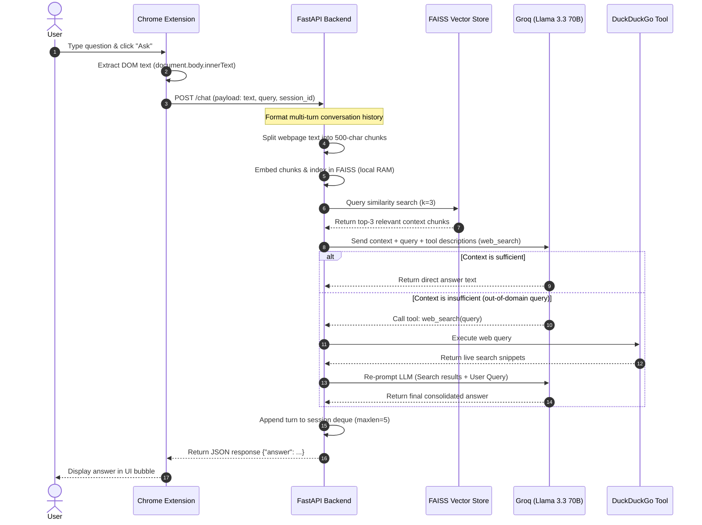

# PageSurf – A Conversational Agentic RAG-Based Chatbot for Any Webpage

PageSurf is an AI-powered Chrome extension that allows you to "chat with any website" in real-time. Whether it's a dense research paper, a long blog post, a Wikipedia article, or a university portal — simply click the extension and ask questions directly. The backend parses the page, indexes it, and uses a smart agent to answer using local context or fallback to live web search.

---

## 🛠️ System Architecture & Data Flow

PageSurf uses a hybrid architecture combining a lightweight Manifest V3 Chrome Extension frontend with an event-driven FastAPI + LangChain backend.

---

## 🚀 Key Technical Features

### 1. Conversational Memory (Multi-Turn Chat)
* **In-Memory History:** The backend implements an in-memory session database (`session_db`) keyed by the user's active Chrome **Tab ID** (ensuring chats remain distinct per tab).
* **Sliding Window:** Uses `collections.deque(maxlen=5)` to automatically manage and restrict history to the last 5 active message pairs, keeping context overhead low and responses concise.

### 2. Tool-Calling Agent Fallback
* **Web Search Tool:** Integrated with `DuckDuckGoSearchRun` to allow the LLM to search the internet if the webpage context lacks the information required to answer the query.
* **Custom Routing:** Avoids heavy LangChain agents by implementing a custom tool invocation loop, parsing the LLM's `tool_calls` object directly for lower latency and transparent execution.

### 3. Production Optimizations
* **Sub-Second RAG:** Embedding generation (`BAAI/bge-small-en` via Hugging Face) and vector searching (FAISS) are computed locally in less than **0.3 seconds**.
* **macOS DNS Socket Patch:** Implemented a network monkey-patch forcing IPv4 socket resolution. This bypasses macOS's broken IPv6 DNS lookup delays, reducing outgoing API latency to Groq from **75 seconds to 0.6 seconds**.

---

## 💻 Tech Stack

* **Frontend:** Vanilla HTML, CSS, JavaScript (Chrome Extension Manifest V3)
* **Backend:** Python, FastAPI, Pydantic
* **LLM Engine:** Groq API running `llama-3.3-70b-versatile`
* **Embeddings:** `SentenceTransformer` with `BAAI/bge-small-en`
* **Vector Store:** Facebook AI Similarity Search (FAISS)
* **Agent Toolkit:** LangChain Core, DuckDuckGo Search API